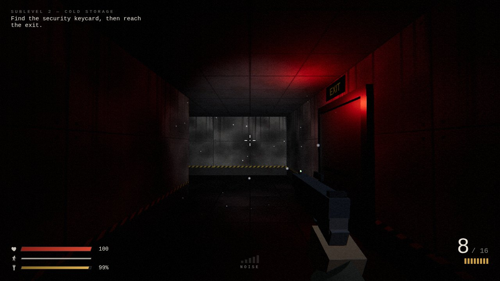

# REMNANT

A first-person survival horror shooter that runs in the browser, built with
TypeScript and Three.js.

You're trapped in the lower sublevels of an abandoned facility. You have a
pistol with barely any ammo and a flashlight with a dying battery, and the
things down here hunt by sound. You can fight, but sneaking is usually
smarter.


| | |
|---|---|
|  |  |

---

## Why I built this

I wanted a project that pushed me outside my usual backend work: real-time
rendering, game AI, audio and performance all in one codebase. I also set
myself one constraint to make it interesting: **no asset files at all.**
Every texture is painted onto a canvas in code when the game starts, and
every sound is synthesized with the Web Audio API. The whole game is
TypeScript plus one dependency, `three`.

---

## Features

**Stealth and survival**
- Everything makes noise. Walking, sprinting and crouching each have a
  different hearing radius, and a HUD meter shows how loud you are.
  Gunshots carry through walls.
- The flashlight is a trade-off: you see more, but monsters can spot you from
  more than twice as far away. The battery drains, and only pickups recharge
  it properly.
- No health regeneration, limited ammo and stamina, and loadout carries over
  between levels.

**Enemy AI**
- Six-state behaviour: patrol → investigate → chase → attack → search →
  back to patrol. Break line of sight and stay quiet, and they lose you.
- Vision cone with suspicion that builds over distance, hearing that walls
  muffle, and attacks with a wind-up you can dodge.
- Grid pathfinding (BFS) with line-of-sight path smoothing, wall collision
  and group separation.
- Two enemy types: the Husk (fast) and the Brute (slow, tanky, hits hard).
- Procedurally animated creatures built from primitives: walk cycles driven
  by actual speed, attack poses, hit flinches and death collapses.

**Graphics**
- Procedural canvas textures (concrete panels, tiles, crates, signs…) with
  bump mapping.
- Physically based lighting, ACES tone mapping, flickering and dying ceiling
  lamps, and a flashlight beam that lags behind your aim.
- A custom post-processing shader: film grain, vignette, damage-driven
  chromatic aberration, and low-health desaturation.
- A first-person pistol with recoil, slide blow-back and a full reload
  animation, rendered in its own pass so it never clips into walls.
- Particles (sparks, blood, dust in the flashlight beam) and bullet-hole
  decals.

**Audio**
- Layered, fully synthesized SFX: gunshot, reload stages, footsteps, creature
  clicks, shrieks and growls.
- Stereo panning by direction, distance falloff, low-pass muffling through
  walls, and convolution reverb.
- Ambient drone with random distant drips and metal groans, and a heartbeat
  at low health.

**Game flow**
- 2 levels (the second has a keycard-locked exit), a main menu over a live
  3D backdrop, pause, settings (sensitivity, FOV, volume, invert Y), and
  death, level-complete and victory screens with stats.

---

## Getting started

Requires Node.js 18+.

```bash
git clone https://github.com/nurmuhammedkanybekov/remnant.git
cd remnant
npm install
npm run dev        # http://localhost:5173
```

Production build (a static site you can host anywhere):

```bash
npm run build      # → dist/
npm run preview
```

Headphones recommended.

---

## Controls

| Key | Action |
|---|---|
| W A S D | Move |
| Mouse | Look |
| Left click | Fire |
| R | Reload |
| Shift | Sprint (loud) |
| C / Ctrl | Crouch (quiet) |
| F | Flashlight |
| Esc | Pause |

**Goal:** reach the exit of both sublevels. On Sublevel 2 you'll need the
security keycard first. Killing enemies is optional.

---

## Tech stack

- **TypeScript** (strict mode)
- **Three.js** r166: rendering, `EffectComposer` post-processing
- **Web Audio API**: all sound
- **Vite**: dev server and build

---

## Project structure

```
src/
├── game.ts            game state machine, level lifecycle, main loop
├── core/              renderer + post-processing, input, clock, settings
├── world/             level parser, collision, raycasting, lamps, pathfinding, levels/
├── player/            movement, flashlight, health
├── enemies/           AI state machine, creature rig, enemy manager
├── weapons/           weapon logic, pistol stats, first-person viewmodel
├── items/             pickups
├── fx/                procedural textures, particles
├── audio/             synthesized sound engine
└── ui/                HUD, menus, styles
```

Levels are plain text grids, so adding one is just drawing a map:

```ts
map: [
  "##########",
  "#S..L...A#",   // S start, L lamp, A ammo
  "#.####.#.#",
  "#...E..#X#",   // E enemy, X exit
  "##########",
],
```

For a deep dive into every system and all the tuning values, see
[`docs/GAME_DESIGN.md`](docs/GAME_DESIGN.md).

---

## Some technical decisions I'm happy with

- **A fixed light budget.** Every dynamic light makes shading more expensive,
  and changing the light count forces shader recompiles (visible stutter). So
  there's a fixed pool of 6 lamp lights that gets reassigned each frame to
  the lamps nearest the player, and the muzzle-flash light always exists
  (it's just at intensity 0 when idle).
- **One grid, many uses.** The same text map drives geometry, circle-vs-grid
  collision, line-of-sight checks, a DDA raycast for bullets, and BFS
  pathfinding.
- **Instanced geometry.** All walls are a single `InstancedMesh`, so the whole
  level is a handful of draw calls.
- **A headless test mode.** With `?debug`, the game exposes hooks to step the
  simulation at a fixed timestep without rendering. That makes it possible to
  test AI behaviour from a script.

---

## Roadmap

- More levels and a third enemy type
- Quiet melee takedowns
- Checkpoints / save system
- Optional flashlight shadows as a quality setting
- Gamepad support and key rebinding

---

## Author

**Nur** — Computer Science student at ELTE (Eötvös Loránd University),
Budapest.
