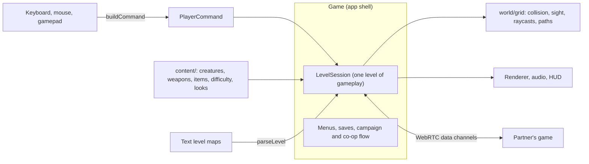

<div align="center">


# REMNANT

**A first-person survival horror game that runs in the browser, solo or in two-player online co-op.**

Climb 2.4 km out of a buried Soviet research station, past things that hunt by sound.

[](https://nurmuhammedkanybekov.github.io/remnant/)

[](https://github.com/nurmuhammedkanybekov/remnant/actions/workflows/deploy.yml)
[](LICENSE)


Desktop browser with a keyboard and mouse, or a gamepad. Headphones recommended.

</div>

<table>
  <tr>
    <td width="50%"></td>
    <td width="50%"></td>
  </tr>
  <tr>
    <td></td>
    <td></td>
  </tr>
  <tr>
    <td></td>
    <td></td>
  </tr>
</table>

> **Object 9 "Zenit"**, a Soviet deep-drilling station buried in the Tian Shan
> mountains, was sealed in 1991. Eleven days ago a mining crew reopened it,
> and the shafts collapsed behind them.
>
> You are **Nur Kanybekov**, a structural engineer. You wake up on the deepest
> sublevel with a pistol that isn't yours and a flashlight with a dying
> battery. The only thing that still works is the radio, and there is a calm
> voice on it telling you the way up.
>
> The things in the dark can't see. They don't need to.

## Contents

1. [Overview](#overview)
2. [Playing](#playing)
3. [Online co-op](#online-co-op)
4. [Game systems](#game-systems)
5. [Architecture](#architecture)
6. [Development](#development)
7. [Credits](#credits)
8. [Roadmap](#roadmap)
9. [License and author](#license-and-author)

## Overview

| Area                   | Summary                                                                                                                   |
| ---------------------- | ------------------------------------------------------------------------------------------------------------------------- |
| **Campaign**           | Ten hand-built levels, a story told over the radio, notes left by survivors, two endings, a three-phase boss.             |
| **Online co-op**       | Two players join with a five-character room code. No accounts, no install, no game server.                                |
| **Stealth**            | Every step makes noise and the flashlight gives you away. Nine creature types, each designed to break a habit.            |
| **Difficulty**         | Five modes, from Story to **Aizi**: more creatures, less ammunition and one life.                                         |
| **Sound**              | Recorded weapons and creatures, 3D positioning, walls that muffle, and adaptive music that tightens as they close in.     |
| **Built from scratch** | TypeScript and Three.js with two runtime dependencies. Creatures, characters, music and most sound are generated in code. |
| **Tested**             | 170 unit tests, every level machine-checked to be completable, a bot that plays the campaign, a two-browser co-op test.   |

## Playing

**[Open the game](https://nurmuhammedkanybekov.github.io/remnant/)**, press any key and choose **New Game**.

The goal is to climb from Sublevel 10 to the surface: find keycards, restore
power and follow the radio, without believing everything it says. Killing
creatures is optional, and often a bad idea.

### Controls

| Action                | Keyboard and mouse | Gamepad     |
| --------------------- | ------------------ | ----------- |
| Move                  | W A S D / arrows   | Left stick  |
| Look                  | Mouse              | Right stick |
| Fire                  | Left click         | RT          |
| Reload                | R                  | X           |
| Sprint (loud)         | Shift              | LT          |
| Crouch (quiet)        | C / Ctrl           | B           |
| Flashlight            | F                  | LB          |
| Use / hold to revive  | E                  | A           |
| Melee / takedown      | V / right click    | RB          |
| Use a medkit          | H                  | D-pad up    |
| Switch weapon         | 1 2 3 / Q / wheel  | Y           |
| Inventory and journal | Tab / I            | View        |
| Pause                 | Esc                | Menu        |

Every keyboard and mouse action can be rebound under **Controls**.

### Difficulty

| Mode          | For                                                                                                     |
| ------------- | ------------------------------------------------------------------------------------------------------- |
| **Story**     | The plot. The fewest creatures, slow to notice you, soft hits.                                          |
| **Normal**    | The intended experience. Extra creatures on every level; they hit hard and run fast once they find you. |
| **Nightmare** | More than twice the creatures, sharper senses, scarce supplies.                                         |
| **Ironman**   | Normal balance with one life for the whole campaign.                                                    |
| **Aizi**      | Beyond Nightmare on every axis, the fewest supplies, and one life. Death ends the run.                  |

The exact numbers are in [`docs/GAME_DESIGN.md`](docs/GAME_DESIGN.md#difficulty-contentdifficultyts).

### Inventory


**Tab** (or **I**) opens the inventory. It has three tabs:

- **Equipment:** health, flashlight battery, medkits, the keycard, every
  weapon with its magazine and reserve ammunition, and the current
  objective. A medkit can be used from here.
- **Journal:** every note you have found, across all your runs, to read
  again at any time.
- **Radio log:** everything said on the radio on this level.

The game pauses while the inventory is open, except in co-op, where the
world keeps going.

### Character

Under **Settings → Character**, choose how you look: a light-skinned man, a
dark-skinned man or a woman. The look is cosmetic. It sets the skin tone of
your own hands, and in co-op it is how your partner sees you.

## Online co-op


1. **The host** opens **Co-op → Host a Game**, picks a sublevel and a
   difficulty, and gets a five-character **room code**.
2. **The partner** opens **Co-op → Join a Game** and types the code.
3. The host presses **Start**.

What changes in co-op:

- **The creatures hunt you both.** There are more of them and they are
  tougher. Each goes after whoever is closest and hears both of you, and
  either flashlight freezes a Watcher.
- **Nobody dies alone.** At zero health you go **down**, and your partner has
  45 seconds to reach you and **hold E** to get you back up. If you are both
  down, the level restarts for both from the last checkpoint.
- **Progress is shared.** One keycard opens the doors for both of you.
  Generators, intercoms, story events and checkpoints happen for both, and
  you leave each level together.
- **Your partner is really there**, in their chosen look, with a headlamp
  that lights the corridor for you. Their gunshots and footsteps come from
  where they are, and their health is on your HUD.
- If your partner leaves, the host carries on alone.

### Connection

The two browsers find each other through a free matchmaking service
([Metered Realtime](https://www.metered.ca/)) and then connect **directly**,
which works on almost all home networks. Some strict networks (school,
office, some mobile data) block direct connections between browsers. For
those, the game falls back automatically to a free **relay** that the
matchmaking service provides. The lobby shows which kind of connection you
got, and every co-op screen shows the build number, so both players can
confirm they are on the same version.

| Message                                 | What to do                                                                     |
| --------------------------------------- | ------------------------------------------------------------------------------ |
| _No game with that code_                | Check the code with the host. Codes never contain 0, O, 1, I or L.             |
| _A different version of REMNANT_        | Both players refresh the page; one of you has an older copy cached.            |
| _That game already has two players_     | Ask the host to open a new room.                                               |
| _Couldn't reach the matchmaking server_ | Check your connection and try again.                                           |
| _Couldn't connect to the other player_  | The screen lists the last connection steps; try again, or add a relay (below). |

<details>
<summary><b>Adding your own relay (optional, about 3 minutes, no credit card)</b></summary>

The relay is [Metered's Open Relay](https://www.metered.ca/tools/openrelay/),
free for 20 GB a month. A two-player game uses roughly 30 to 40 MB an hour.

1. Sign up at [metered.ca/tools/openrelay](https://www.metered.ca/tools/openrelay/).
   Your app gets a domain such as `remnant.metered.live`.
2. In the Metered dashboard, open your TURN project, choose
   **Manage TURN Credentials → Add Credential**, then **Show API Key** next to
   the new credential and copy it. Other keys in the dashboard (the
   `pk_live_` key or the secret key) are refused by the relay.
3. In this repository on GitHub, open **Settings → Secrets and variables →
   Actions → Variables → New repository variable** and add:
   - `METERED_APP`: your app domain, for example `remnant.metered.live`
   - `METERED_API_KEY`: the credential's API key from step 2

   Saving them as **Secrets** also works.

4. Re-run the deployment: **Actions → Deploy to GitHub Pages → Run workflow**.
5. Open **Co-op** in the game. It checks the relay and shows **Relay: on**
   when the key works, or **Relay: key refused** when it does not.

Any other TURN server also works: set `TURN_URLS` (comma-separated),
`TURN_USERNAME` and `TURN_CREDENTIAL` instead.

</details>

## Game systems

### Stealth and survival

- **Everything makes noise.** Walking, sprinting, crouching and wading each
  carry a different distance, and a HUD meter shows how loud you are.
  Gunshots carry through walls.
- **The flashlight is a trade-off.** You see more, but creatures spot you
  from more than twice as far away. The battery drains, and only pickups
  recharge it properly.
- **Scarcity.** No health regeneration, limited ammunition and stamina, and
  your loadout carries over between levels.

### Creatures

| Creature        | Behaviour                                                                            |
| --------------- | ------------------------------------------------------------------------------------ |
| **Husk**        | Fast, fragile hunter.                                                                |
| **Brute**       | Slow, tough, hits hard. Can't be taken down quietly.                                 |
| **Listener**    | Blind. The flashlight means nothing to it; every footstep does.                      |
| **Watcher**     | Freezes while a flashlight is on it, and is extremely fast when it isn't.            |
| **Crawler**     | Clings upside down to the ceiling and drops on you.                                  |
| **Spitter**     | Keeps its distance and lobs acid you can sidestep.                                   |
| **Swarm**       | A pack of rewritten rats: fast, weak, everywhere.                                    |
| **Mimic**       | Hides and imitates footsteps, pickups and the Operator's voice.                      |
| **The Remnant** | A three-phase boss with an armoured hide and a core that opens only when it attacks. |

They patrol, investigate what they hear, chase you, lose you and search for
you. Suspicion builds while you are in view, attacks have a wind-up you can
dodge, and a quiet melee strike from behind kills outright. Up close they
show teeth, sunken glowing eyes and bone through the skin; they breathe,
their jaws chatter while they hunt, and their necks spasm.

### Combat

- **Three weapons:** a sidearm, a nearly silent **rivet gun**, and a pump
  **shotgun** that loads shell by shell.
- **Takedowns and shoves:** melee from behind an unaware creature is a
  silent kill; from the front it buys you a second.
- **Medkits are carried** (up to three) and used when you choose, which
  takes time you might not have.

### Campaign

- **Ten levels**, from the infirmary on Sublevel 10 to the surface, each
  introducing something new: flooded halls, keycard doors, a maze of ducts,
  generators that draw every creature on the floor, the hive.
- **A story told over the radio**, with subtitles and a synthesized radio
  voice, and notes from survivors collected in the journal. **Two endings.**
- **Checkpoints**, saves, chapter select and best times per level.

### Presentation

- **Photo-scanned materials** (concrete, steel, hazard paint, wood, ceiling
  tiles) with normal and roughness maps, and the facility's details painted
  over them in code: panel seams, rivets, kick plates, water damage, blood.
- **Lighting:** a real flashlight, flickering and dying ceiling lamps,
  emergency lights, ACES tone mapping, and a post-processing pass with film
  grain, vignette and damage effects.
- **Audio:** recorded weapons, footsteps, doors and creature voices, placed in
  3D with distance falloff, wall muffling and reverb; an ambient drone, a
  heartbeat at low health, and adaptive music that swells and fades with the
  danger you are in.

### Options and accessibility

Fully rebindable controls, gamepad support for play and every menu,
Low/Medium/High graphics, subtitle size, HUD size, a colour-blind friendly
HUD, reduced camera shake, field of view, sensitivity, invert Y, and separate
music and master volume.

## Architecture



- **`Game`** owns the long-lived services (renderer, audio, UI, saves), runs
  the main loop and moves between menus, levels and co-op lobbies.
- **`LevelSession`** is one attempt at one level. It is created fresh every
  time and discarded afterwards, so no state leaks between levels or retries.
- **`PlayerCommand`** is the only way player intent reaches the simulation,
  whether it comes from the keyboard, a gamepad or the headless test harness.
- **`content/`** is data. Adding a creature means adding a definition; its
  map glyph works in levels immediately.

### Co-op networking

```mermaid
sequenceDiagram
    participant H as Host's game
    participant S as Matchmaking (Metered Realtime)
    participant G as Guest's game
    H->>S: join the room's channel
    G->>S: join; is anyone hosting?
    G->>S: connection offer (all routes gathered)
    S->>H: offer
    H->>S: answer
    S->>G: answer
    H-->G: direct WebRTC connection, or through the relay
    Note over H,G: from here the games talk peer to peer
    G->>H: my position 20 times a second, actions as requests
    H->>G: my position, creature snapshots 15 times a second, events
```

The **host runs the world**: creatures, doors, generators, the boss and the
end of the level. Each player moves their **own** character locally, so
movement never waits on the network. The guest's creatures are puppets that
follow the host's snapshots, and the guest's actions go to the host as
requests. Events travel on a reliable channel and positions on a fast, lossy
one, where a late packet is worthless anyway.

The connection is built to survive real networks: the offer and answer are
re-sent until acknowledged, keep-alive timers run in a worker so background
tabs are not throttled, every level attempt is numbered so messages from
before a retry are dropped, and mismatched builds refuse to connect rather
than drift apart. When a connection fails, the screen shows the last steps
of the handshake.

### Engineering notes

- **A fixed light budget.** Changing the number of lights forces shader
  recompiles (visible stutter), so a pool of lamp lights is reassigned each
  frame to the lamps nearest the player, and lights that come and go (muzzle
  flash, your partner's headlamp) exist from the start at zero intensity.
- **One grid, many uses.** The same text map drives geometry, circle-versus-
  grid collision, line of sight, a DDA raycast for bullets and BFS
  pathfinding.
- **Levels are verified, not trusted.** A lock-aware validator flood-fills
  every map and fails the build if an exit, keycard, generator or pickup is
  unreachable, or a keycard sits behind the door it opens.
- **Deterministic extra creatures.** Harder difficulties and co-op add
  creatures by seeded placement (far from the start, spread out, only kinds
  the story has already introduced), so both co-op players get the same ones.
- **Saves that can't brick the game.** The save is versioned and validated
  field by field: old versions are migrated, corrupt values are repaired, and
  the game runs even when browser storage is blocked.
- **Logic that runs without a GPU.** Parsing is separate from geometry and
  the simulation runs on commands, so almost everything is testable in Node.

### Project layout

```
src/
├── game/       app shell, level session, co-op partner and its model, saves, loadout, stats
├── net/        co-op: matchmaking, WebRTC link, relay settings, message protocol, timers
├── content/    creature, weapon, item, difficulty, character and sound definitions
├── world/      level format, parser, validator, builder, grid, pathfinding, extra creatures
├── enemies/    AI state machine, creature bodies, boss, projectiles
├── player/     commands, movement, flashlight, health
├── weapons/    weapon logic, first-person viewmodel
├── core/       renderer, input, gamepad, actions and bindings, settings, quality
├── fx/         textures, particles
├── audio/      sound engine, recorded samples, adaptive music
└── ui/         HUD, menus, inventory, styles
```

A level is a text map plus a small script:

```ts
map: [
  "############",
  "#S.a.D..L.A#", // S start, a trigger, D door, L lamp, A ammo
  "#.####.###.#",
  "#.Y..E.K.=X#", // Y intercom, E husk, K keycard, = security door, X exit
  "############",
],
triggers: {
  a: [radio(op("Something is moving past that door. Stay low.")), checkpoint()],
},
```

Every system and its tuning values are documented in
[`docs/GAME_DESIGN.md`](docs/GAME_DESIGN.md).

## Development

Requires Node.js 18 or newer.

```bash
git clone https://github.com/nurmuhammedkanybekov/remnant.git
cd remnant
npm install
npm run dev        # http://localhost:5173
```

| Script             | Description                                        |
| ------------------ | -------------------------------------------------- |
| `npm run dev`      | Development server with hot reload                 |
| `npm run build`    | Typecheck and build a static site into `dist/`     |
| `npm run preview`  | Serve the production build                         |
| `npm test`         | Unit tests                                         |
| `npm run check`    | Typecheck, formatting and tests (what CI runs)     |
| `npm run format`   | Format everything with Prettier                    |
| `npm run playtest` | A bot plays the campaign and reports on each level |

### Configuration

The deployed build reads these optional GitHub repository variables (or
secrets). None are required.

| Variable                                        | Purpose                                                          |
| ----------------------------------------------- | ---------------------------------------------------------------- |
| `METERED_APP`, `METERED_API_KEY`                | Your own Metered relay (see [Online co-op](#online-co-op)).      |
| `TURN_URLS`, `TURN_USERNAME`, `TURN_CREDENTIAL` | Any other TURN relay.                                            |
| `METERED_REALTIME_KEY`                          | A different matchmaking key; `off` uses a PeerJS server instead. |

For testing, `?debug` exposes test hooks on `window.game`, and
`?signal=wss://…/peerjs` uses your own
[PeerJS server](https://github.com/peers/peerjs-server) for matchmaking.

### Testing

- **Unit tests** (Vitest, 170): level parsing and validation, collision,
  raycasts, pathfinding, movement, weapons, creature AI run headlessly
  (blindness, light-freezing, ceiling drops, spitting, lures, takedowns, the
  boss's phases), co-op targeting and snapshots, extra creature placement,
  matchmaking against a fake service, room codes, relay settings, loadouts,
  the inventory, bindings, settings and save migration. **Every level is
  checked to be completable.**
- **Playtest bot** (`npm run playtest`): plays the campaign in a real browser
  and reports time, deaths, damage, kills and ammunition per level.
- **Co-op end to end** (`tools/coop/run.mjs`): two real browsers go through
  the menus with a room code and check shared doors and pickups, the guest's
  shots killing the host's creature, character looks, down and revive, wipe
  and retry, leaving together and a partner leaving, directly or through a
  relay.
- **CI** runs the typecheck, formatting check and tests on every push; a
  failing check blocks deployment to GitHub Pages.

## Credits

Creatures, characters, levels, music and most sound effects are generated in
code. Two kinds of recorded material are used where code can't match them,
both public domain (CC0) and each with a generated fallback:

- **Sound effects** (weapons, footsteps, doors, voices) from
  [Freesound](https://freesound.org) contributors; see
  [`public/sfx/CREDITS.md`](public/sfx/CREDITS.md).
- **Surface materials** (concrete, steel, wood, ceiling tiles) from
  [ambientCG](https://ambientcg.com); see
  [`public/textures/CREDITS.md`](public/textures/CREDITS.md).

## Roadmap

| Phase                                                           | Status  |
| --------------------------------------------------------------- | ------- |
| 1. Foundations                                                  | Done    |
| 2. Campaign: ten levels, radio dialogue, endings                | Done    |
| 3. Creatures, melee, more weapons                               | Done    |
| 4. Adaptive music, interface, gamepad                           | Done    |
| 5. Accounts and cloud saves                                     | Planned |
| 6. Two-player online co-op                                      | Done    |
| 7. Aizi mode, inventory and journal, character looks, creatures | Done    |

Details are in [`docs/ROADMAP.md`](docs/ROADMAP.md); the story bible is
[`docs/STORY.md`](docs/STORY.md).

## License and author

Released under the [MIT License](LICENSE). The CC0 sounds and textures are in
the public domain.

**Nurmuhammed Kanybekov**, Computer Science student at ELTE (Eötvös Loránd
University), Budapest. REMNANT is a project to go beyond backend work into
real-time rendering, game AI, audio, networking and performance, in one
codebase built from scratch.
