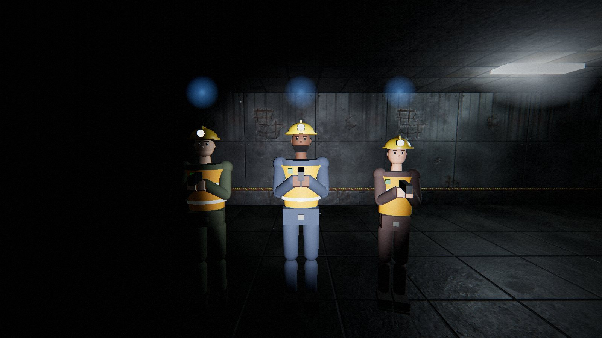
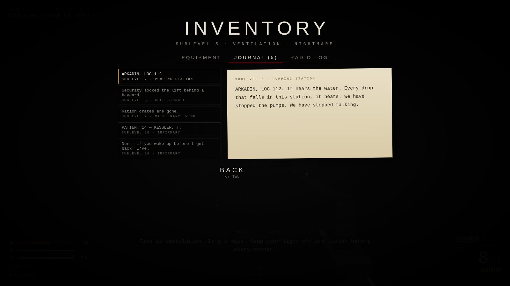
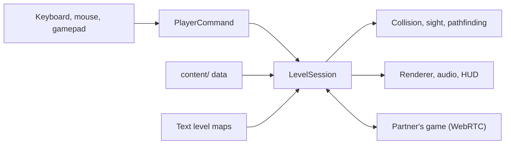
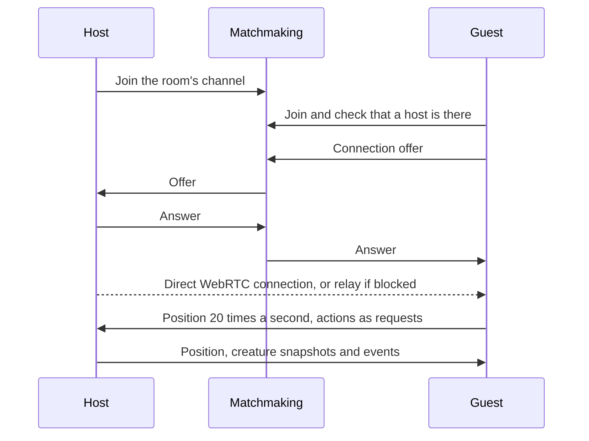

<div align="center">


# REMNANT

A first-person survival horror game that runs in the browser. Play it alone, or online with up to two friends.

**[Play it here](https://nurmuhammedkanybekov.github.io/remnant/)**

[](https://github.com/nurmuhammedkanybekov/remnant/actions/workflows/deploy.yml)
[](LICENSE)


</div>

## About

In 1991 the Soviet deep-drilling station Object 9 "Zenit" was sealed and
forgotten under the Tian Shan mountains. Eleven days ago a mining crew opened
it again, and the shafts collapsed behind them.

You are one of three survivors of the crew: Nur Kanybekov, a structural
engineer; Raiymbek Asanov, a drilling foreman; or Nuraiza Akylbek, a field
geologist. You wake up on the deepest sublevel with a pistol that isn't yours
and a flashlight that is almost dead. The radio still works, and a calm voice on it offers to guide you to the
surface, 2.4 km above. The things down there are blind, but they hear
everything.

I built REMNANT from scratch in TypeScript and Three.js as a way to learn the
parts of software I don't touch in backend work: real-time rendering, game AI,
3D audio, networking and performance. There is no game engine underneath, and
almost everything you see and hear (the creatures, the characters, the music,
most of the sound) is generated in code.

<table>
  <tr>
    <td width="50%"></td>
    <td width="50%"></td>
  </tr>
  <tr>
    <td></td>
    <td></td>
  </tr>
  <tr>
    <td></td>
    <td></td>
  </tr>
</table>

## Contents

- [What's in the game](#whats-in-the-game)
- [How to play](#how-to-play)
- [Co-op](#co-op)
- [Saves](#saves)
- [How it works](#how-it-works)
- [Running it yourself](#running-it-yourself)
- [Credits and license](#credits-and-license)

## What's in the game

**The campaign.** Ten hand-built levels, from the deepest sublevel up to the
surface, with a story told over the radio, notes left by the people who were
there before you, a three-phase boss and two endings. Every note answers a
question the last one raised: why the station was sealed, who the voice on
the radio really is, and what is waiting at the top, so the story comes
together as you climb. The rooms have a purpose (wards, labs, freezers,
pump halls, an armory with its racks nearly empty) and are furnished to
match, with signs by their doors. Pipes painted to the Soviet colour code
run the length of the corridors, frosted and hung with icicles in cold
storage, and what the crew scrawled on the walls is still there. Every level
hides a room behind a loose wall panel.

**Stealth that matters.** The creatures are blind, but they hear everything.
Every step makes noise, sprinting and wading make more, and a creature right
beside you can hear you breathe, so you hold your breath while it walks past.
Your flashlight is the other half of it: turn it on in the dark and anything
that sees the light comes for you straight away. A thrown bottle sends them
somewhere else.

**Creatures that hunt.** Nine kinds, each designed to break a habit the
previous one taught you: one that only hears, one that freezes in your light,
one that waits on the ceiling, one that imitates the voice on the radio. Some
of them wander the whole level, and every so often one is drawn towards
wherever you are, so nowhere stays safe for long. They are dark and hard
to pick out until they are close, and their eyes only catch your light at
short range. Lamps stutter when one is near, and your heart beats faster
when something is close that you can't see.

**Scarce supplies.** Three weapons, silent takedowns from behind, and
medkits you carry and use when you choose. Ammunition comes in small caches
spread across each level, so you find it by exploring.

**Together.** Online co-op for two or three players with a room code, and
voice chat that comes from where each player stands. Each character has
their own helmet colour and reflective tape, and a name tag floats above
every partner, so you can find each other in the dark. No accounts, no
installs.

**And the rest.** Three characters to play as (the radio and the notes call
you by your own name), five difficulty modes, an inventory with a journal of
every note you've found, cloud saves with Google sign-in, an online
leaderboard of best times, full gamepad support, rebindable controls and
accessibility options.

## How to play

Open the game in a desktop browser, press any key and choose New Game.
Headphones help a lot, because most threats are heard before they are seen.

| Action                | Keyboard and mouse | Gamepad  |
| --------------------- | ------------------ | -------- |
| Move / look           | WASD / mouse       | Sticks   |
| Fire / reload         | Left click / R     | RT / X   |
| Sprint / crouch       | Shift / C          | LT / B   |
| Flashlight            | F                  | LB       |
| Use, hold to revive   | E                  | A        |
| Melee or takedown     | V or right click   | RB       |
| Medkit                | H                  | D-pad up |
| Hold breath           | B (hold)           | L3       |
| Throw a bottle        | G                  | R3       |
| Push to talk (co-op)  | T (hold)           | —        |
| Switch weapon         | 1 2 3, Q or wheel  | Y        |
| Inventory and journal | Tab or I           | View     |
| Pause                 | Esc                | Menu     |

All keyboard and mouse controls can be rebound in the Controls menu.

### Difficulty

- **Story**: for the plot. Few creatures, and they are slow to notice you.
- **Normal**: how I meant it to be played. More creatures, and they hit hard.
- **Nightmare**: more than twice the creatures, sharper senses, scarce ammo.
- **Ironman**: Normal, but with one life for the whole campaign.
- **Aizi**: harder than Nightmare in every way, the fewest supplies, and one
  life. If you die, the run is over.

Harder modes also leave less lying around. Story has about 40% more
medkits and batteries than Normal, Aizi fewer, and each pickup gives less on
the harder modes. When you die and retry, your pistol is topped up to a small
minimum, so an empty gun can't trap you in a loop. Co-op levels have more
supplies (80% more for two players, 140% more for three), because every
pickup is shared. The exact numbers are in the
[design document](docs/GAME_DESIGN.md#difficulty-contentdifficultyts).

### Characters and inventory



Tab opens the inventory. The Equipment tab shows your health, battery,
medkits, bottles, keycard and ammo for each weapon. The Journal keeps every note you
have picked up, across all your runs, and the Radio log has everything said
on the current level.

You choose who you play when you start a new game (or in the co-op menu):

| Character           | Who they are                                                             |
| ------------------- | ------------------------------------------------------------------------ |
| **Nur Kanybekov**   | Structural engineer on the survey team. Practical, dry, stubborn.        |
| **Raiymbek Asanov** | Drilling foreman. Twenty years underground, the calmest man in a crisis. |
| **Nuraiza Akylbek** | Field geologist. She mapped these tunnels before anyone else went down.  |

The story is the same for all three, but the voice on the radio, the notes
and the subtitles use your character's name. In co-op the others see your
character (yellow, white or orange helmet), their name above their head,
and their names on your HUD in the same colour.

## Co-op


One player opens Co-op, chooses Host a Game and gets a five-letter room code.
Up to two others choose Join a Game and type it in. The host starts when
everyone is in.

When you play together, all of you are hunted, and there are more creatures
than in solo play (more again with three). If your health runs out you go
down instead of dying, and the others have 45 seconds to reach you and hold E
to revive you. Keycards, doors, generators and checkpoints are shared, and you
leave each level together. If someone leaves, the others keep playing.

Voice chat is built in: hold T to talk (or switch to open mic in Settings).
Voices come from where each player stands and are muffled through walls. The
creatures can hear you talking too, so whisper, or wait until it's clear.

The browsers find each other through a free matchmaking service and then
connect directly. On networks that block direct connections (some schools,
offices and mobile carriers) the game switches to a relay automatically.

<details>
<summary>Troubleshooting and adding your own relay</summary>

| You see                                | Try this                                                               |
| -------------------------------------- | ---------------------------------------------------------------------- |
| "No game with that code"               | Check the code. Codes never use 0, O, 1, I or L.                       |
| "A different version of REMNANT"       | Everyone refreshes the page. The build number is on every screen.      |
| "That game already has three players"  | The host opens a new room.                                             |
| No voice                               | Allow the microphone when the browser asks, and check Settings.        |
| Creatures stutter for a guest          | Usually the host's computer or Wi-Fi. The host should be the fastest.  |
| "Couldn't connect to the other player" | The screen shows the last connection steps. Try again, or add a relay. |

The game already gets a relay from the matchmaking service. If you want your
own, [Metered's Open Relay](https://www.metered.ca/tools/openrelay/) is free
for 20 GB a month, which is hundreds of hours of play:

1. Sign up and create a TURN project. Your app gets a domain such as
   `remnant.metered.live`.
2. Under Manage TURN Credentials, add a credential and copy its API key.
   (The `pk_live_` key and the secret key won't work for this.)
3. In the GitHub repository, go to Settings, Secrets and variables, Actions,
   Variables, and add `METERED_APP` (the domain) and `METERED_API_KEY`.
4. Re-run the Deploy to GitHub Pages workflow. The co-op menu will say
   "Relay: on".

Any other TURN server works too, through `TURN_URLS`, `TURN_USERNAME` and
`TURN_CREDENTIAL`.

</details>

## Saves

The game saves in your browser at the start of every level and at
checkpoints. From the Saves screen on the main menu you can also:

- **Sign in with Google** to keep your progress in the cloud and continue on
  another computer. Changes upload a few seconds after they happen. When two
  copies meet, nothing is lost: unlocks, endings and notes are combined, and
  you continue whichever run you played most recently.
- **Export and import a save file**, which works without any account.

Signed in, your best time on every level also goes up to the **Leaderboard**
(main menu), per difficulty, solo and co-op. It shows the top three on each
level and where you stand. Only your first name is shown.

<details>
<summary>Setting up cloud saves on your own copy (free, about 10 minutes)</summary>

Cloud saves use Firebase's free Spark plan, which needs no credit card. A
save is a few kilobytes, so the free limits are far more than enough.

1. In the [Firebase console](https://console.firebase.google.com/), create a
   project and turn Google Analytics off.
2. Authentication, Sign-in method: enable **Google**.
3. Authentication, Settings, Authorized domains: add your GitHub Pages
   domain, for example `nurmuhammedkanybekov.github.io`.
4. Firestore Database: create a database in production mode.
5. Firestore, Rules: paste in [`firebase/firestore.rules`](firebase/firestore.rules)
   and publish. Each player can then read and write only their own save, and
   only their own leaderboard entry, which any signed-in player can read.
6. Project settings, General, Your apps: add a Web app and copy `apiKey` and
   `projectId` from its config. Copy the key exactly; it starts with `AIza`.
7. In the GitHub repository, add the variables `FIREBASE_API_KEY` and
   `FIREBASE_PROJECT_ID`, then re-run the Deploy to GitHub Pages workflow.

The web API key is meant to be public. The database rules are what protect
the data.

</details>

<details>
<summary>Backing up the cloud saves (free, automatic)</summary>

Firestore's own scheduled backups need a paid plan, so the repository backs
the saves up itself. The [Back up cloud saves](.github/workflows/backup.yml)
workflow runs every day, reads every save, encrypts the file with a
passphrase only you know, and keeps it for 90 days as a download on that
workflow run. The repository is public, and the encryption is what keeps
players' saves private.

To switch it on:

1. Firebase console, Project settings, **Service accounts**, **Generate new
   private key**. This downloads a JSON file. Keep it secret.
2. In the GitHub repository, add two **secrets** (not variables):
   `FIREBASE_SERVICE_ACCOUNT` with the whole contents of that JSON file, and
   `BACKUP_PASSPHRASE` with a long passphrase. Write the passphrase down
   somewhere safe; without it the backups can't be opened.
3. Actions, **Back up cloud saves**, **Run workflow** to take the first
   backup straight away. After that it runs every night by itself.

There is nothing to do day to day. Once a month it is worth downloading the
latest backup and keeping it somewhere of your own, because GitHub deletes
them after 90 days: Actions, Back up cloud saves, the latest run, and the
file under Artifacts. The file stays encrypted, so it is safe to store
anywhere.

You only restore if saves are actually lost. From the repository folder,
with the backup file and the service account key at hand:

```bash
export BACKUP_PASSPHRASE="your passphrase"
export FIREBASE_SERVICE_ACCOUNT="$(cat path/to/service-account.json)"

# see what the backup holds (writes nothing)
node tools/backup/firestore.mjs restore remnant-saves-2026-09-27.enc.json

# write every save back into Firestore
node tools/backup/firestore.mjs restore remnant-saves-2026-09-27.enc.json --yes

# or just read it as plain JSON (delete the file afterwards)
node tools/backup/firestore.mjs decrypt remnant-saves-2026-09-27.enc.json > saves.json
```

On Windows PowerShell, set the two values with
`$env:BACKUP_PASSPHRASE = "..."` and
`$env:FIREBASE_SERVICE_ACCOUNT = Get-Content path\to\service-account.json -Raw`.

Players also keep their own copy: the save in their browser, and any save
file they export.

</details>

## How it works

The game is a static website with no server of its own. `Game` owns the
renderer, audio, menus and saves, and runs the main loop. Each attempt at a
level is a fresh `LevelSession`, so nothing can leak from one attempt into the
next. Player input is turned into a `PlayerCommand` before it reaches the
simulation, which is why the same code can be driven by a keyboard, a
gamepad, a test script or the network.



### Co-op networking



The host runs the world: creatures, doors, generators, the boss and the end
of each level. Each player moves their own character locally, so movement
never waits for the network. The guest's creatures follow the host's
snapshots. Events go over a reliable channel and positions over a fast one,
where a late packet is simply dropped.

With three players, each guest connects to the host only. Once the first
guest is in, the host opens the room again under the same code for a second,
and from then on passes on what one guest says that the other needs
(positions, shots, throws, pickups, revives). Voice travels the same way: every
connection carries two audio channels, one for the other end's microphone and
one for the third player's voice relayed by the host.

Getting this to work on real home networks took more effort than the rest of
co-op put together. The handshake is re-sent until it is answered,
keep-alive timers run in a Web Worker so background tabs don't stall them,
every level attempt is numbered so old messages can't leak into a retry, and
two different builds refuse to connect instead of drifting apart.

### A few details I'm happy with

- Changing the number of lights in Three.js recompiles shaders and causes a
  stutter, so the level uses a fixed pool of lights that is reassigned to the
  lamps nearest the player every frame. Co-op partners' headlamps exist from
  the start of a level for the same reason.
- On a guest's screen, creatures keep moving between the host's snapshots
  at their last known speed, and a snapshot that arrives late is thrown away,
  so a slow network doesn't make them stall or jump back.
- With three players the host forwards one guest's voice to the other over
  the same peer-to-peer connection, so voice chat needs no server.
- One text grid drives the level geometry, collision, line of sight, bullet
  raycasts and pathfinding.
- Every level is checked by a validator that fails the build if an exit,
  keycard or generator can't be reached.
- Extra creatures, ammunition caches and bottles are placed by seeded
  algorithms, so every co-op player gets exactly the same level.
- Saves are versioned and validated field by field. Old saves are migrated,
  broken values are repaired, and the game still runs if storage is blocked.

### Project layout

```
src/
  game/      app shell, level session, co-op partner, saves
  net/       matchmaking, WebRTC link, relay, voice, cloud saves, leaderboard
  content/   creatures, weapons, items, difficulty, characters
  world/     level format, parser, validator, builder, grid, pathfinding
  enemies/   AI, creature bodies, boss, projectiles
  items/     pickups, thrown bottles
  player/    input commands, movement, breathing, flashlight, health
  weapons/   weapon logic, first-person models
  core/      renderer, input, gamepad, settings
  fx/        textures, particles
  audio/     sound engine, samples, adaptive music
  ui/        HUD, menus, inventory
```

Levels are plain text maps with a small script attached:

```ts
map: [
  "############",
  "#S.a.D..L.A#", // S start, a trigger, D door, L lamp, A ammo
  "#.####.###.#",
  "#.Y..E.K.=X#", // Y intercom, E creature, K keycard, = locked door, X exit
  "############",
],
triggers: {
  a: [radio(op("Something is moving past that door. Stay low.")), checkpoint()],
},
```

Every system and its tuning values are written up in
[docs/GAME_DESIGN.md](docs/GAME_DESIGN.md), the plan and its history in
[docs/ROADMAP.md](docs/ROADMAP.md), and the story in
[docs/STORY.md](docs/STORY.md).

## Running it yourself

You need Node.js 18 or newer.

```bash
git clone https://github.com/nurmuhammedkanybekov/remnant.git
cd remnant
npm install
npm run dev
```

The game is then at http://localhost:5173. Other useful commands:

- `npm run check` runs the type checker, the formatting check and the tests.
  CI runs the same thing, and a failure blocks deployment.
- `npm run build` builds the static site into `dist/`.
- `npm run playtest` lets a bot play the campaign and report on each level.
- `node tools/coop/run.mjs` opens two browsers and plays through a co-op
  session: joining with a code, shared doors and pickups, reviving, retrying,
  finishing a level together and leaving.

There are 248 unit tests covering level validation, collision, pathfinding,
movement, breathing, weapons, thrown bottles, creature AI, loot placement,
room furnishing, co-op, save merging, cloud sync, the leaderboard, settings
and more. Adding `?debug` to the URL exposes test hooks on `window.game`.

Every push to `main` is checked and deployed to GitHub Pages. The optional
repository variables are the relay and cloud save settings described above.

## Credits and license

Recorded sound effects come from [Freesound](https://freesound.org) and
surface textures from [ambientCG](https://ambientcg.com), all released into
the public domain (CC0). The full lists are in
[public/sfx/CREDITS.md](public/sfx/CREDITS.md) and
[public/textures/CREDITS.md](public/textures/CREDITS.md). Thanks to everyone
who shares their work for free.

The code is released under the [MIT License](LICENSE).

Made by **Nurmuhammed Kanybekov**, a Computer Science student at ELTE (Eötvös
Loránd University) in Budapest.
