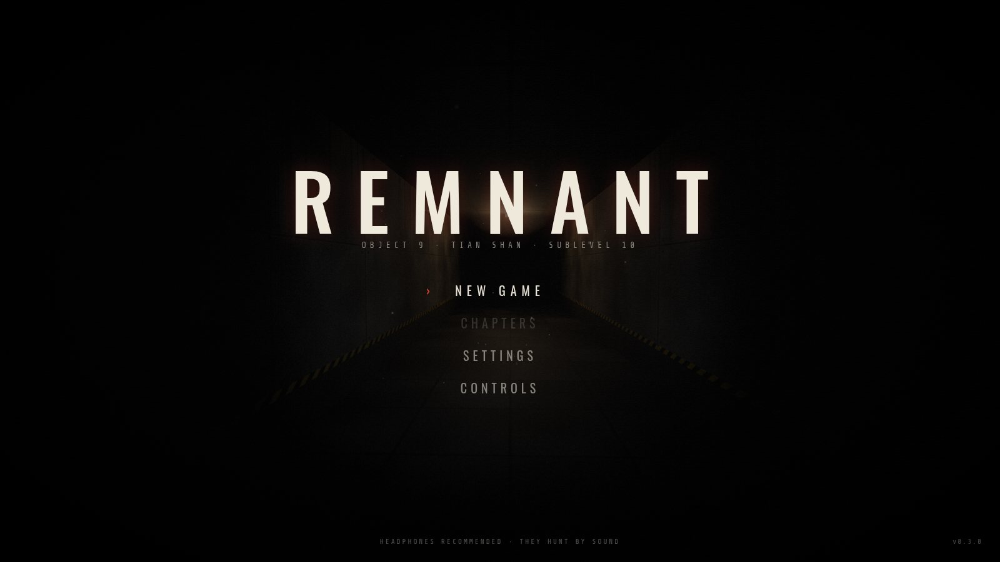
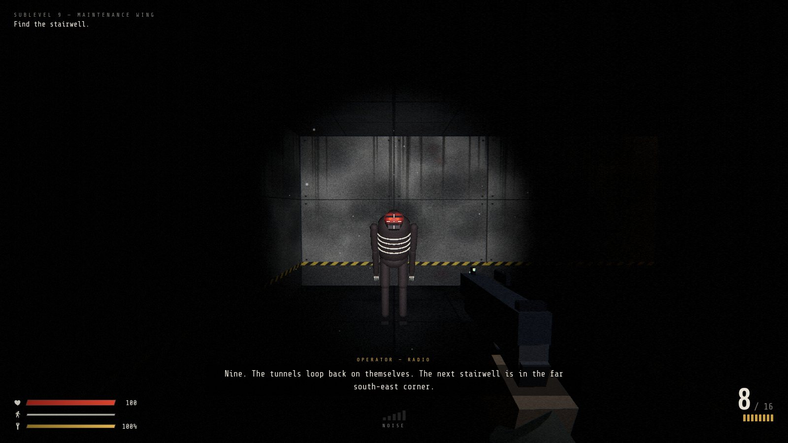
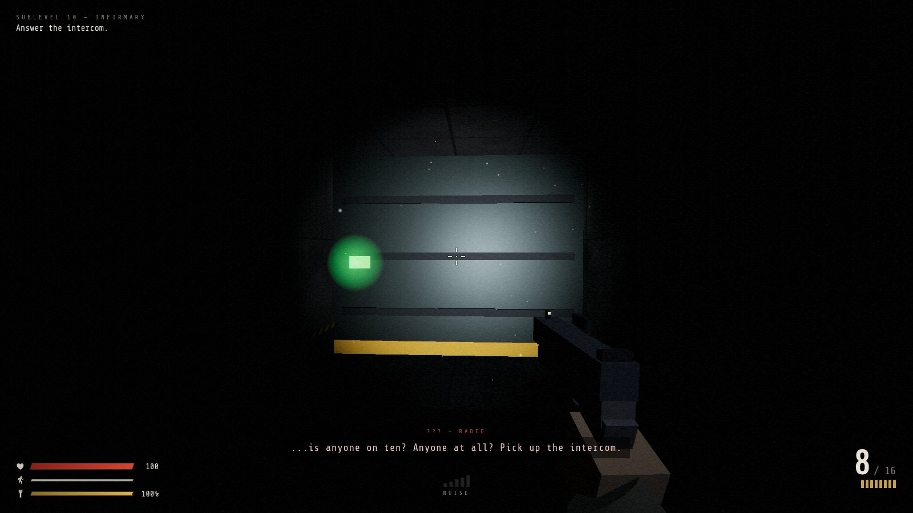
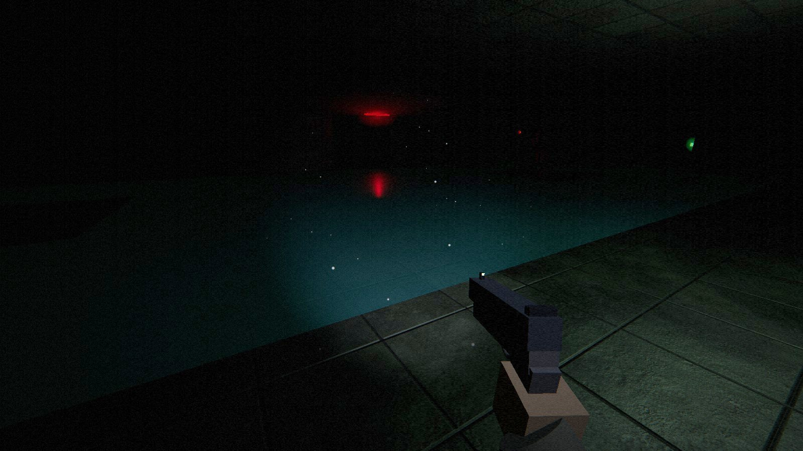
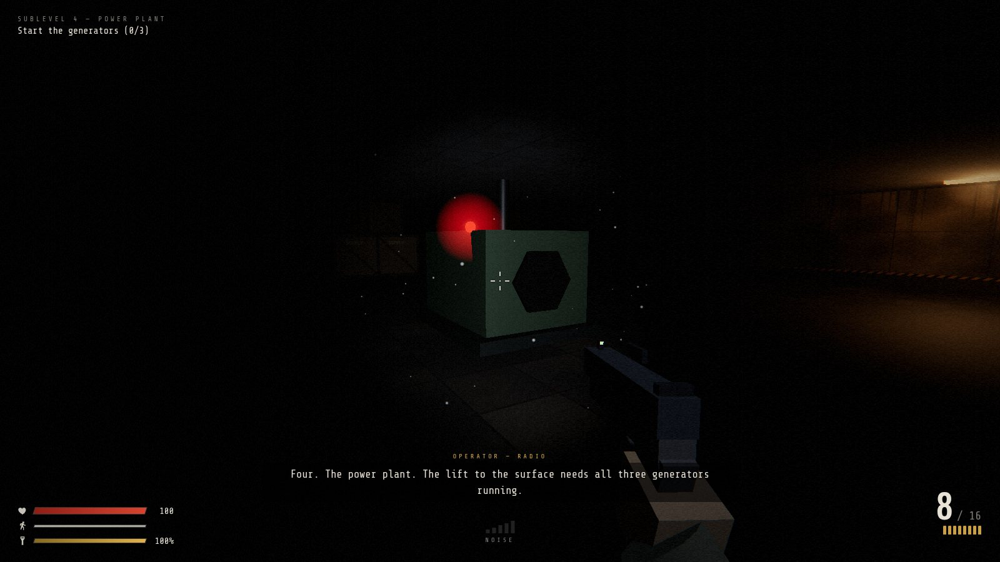
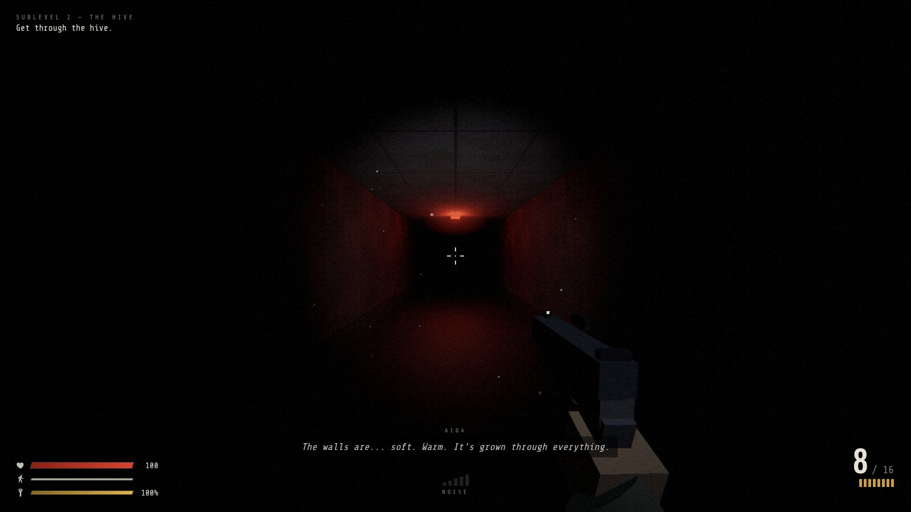
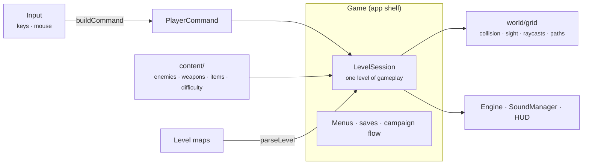

<div align="center">

# REMNANT

**A first-person survival horror shooter that runs in the browser.**
<br>
Built from scratch with TypeScript and Three.js. No asset files: every texture, model and sound is generated in code.

[](https://github.com/nurmuhammedkanybekov/remnant/actions/workflows/deploy.yml)


### ▶ [Play it in your browser](https://nurmuhammedkanybekov.github.io/remnant/)

_Desktop with mouse and keyboard. Headphones strongly recommended._



|                                                                |                                                                       |
| -------------------------------------------------------------- | --------------------------------------------------------------------- |
|  |  |
|      |      |

</div>

---

> **Object 9 "Zenit"**, a Soviet deep-drilling station buried in the Tian Shan
> mountains, was sealed in 1991. Eleven days ago a mining crew reopened it,
> and the shafts collapsed behind them.
>
> You wake up on the deepest sublevel with a pistol that isn't yours and a
> flashlight with a dying battery. The only thing that still works is the
> radio, and there is a calm voice on it telling you the way up.
>
> The things in the dark can't see. They don't need to.

---

## Contents

- [Why I built this](#why-i-built-this)
- [Features](#features)
- [Controls](#controls)
- [Getting started](#getting-started)
- [Architecture](#architecture)
- [Engineering highlights](#engineering-highlights)
- [Testing](#testing)
- [Roadmap](#roadmap)
- [Documentation](#documentation)

---

## Why I built this

I wanted a project that pushed me outside my usual backend work: real-time
rendering, game AI, audio and performance all in one codebase. I also set
myself one constraint to make it interesting: **no asset files at all.**
Every texture is painted onto a canvas in code when the game starts, and
every sound is synthesized with the Web Audio API. The whole game is
TypeScript plus one runtime dependency, `three`.

---

## Features

### Stealth and survival

- **Everything makes noise.** Walking, sprinting and crouching each have a
  different hearing radius, and a HUD meter shows how loud you are. Gunshots
  carry through walls.
- **The flashlight is a trade-off.** You see more, but creatures can spot
  you from more than twice as far away. The battery drains, and only pickups
  recharge it properly.
- **Scarcity.** No health regeneration, limited ammo and stamina, and your
  loadout carries over between levels.

### Enemy AI

- **Six-state behaviour:** patrol → investigate → chase → attack → search →
  patrol. Break line of sight and stay quiet, and they lose you.
- **Perception:** a vision cone where suspicion builds with distance, hearing
  that walls muffle, and attacks with a wind-up you can dodge.
- **Navigation:** grid BFS pathfinding with line-of-sight path smoothing,
  wall collision and group separation.
- **Procedural animation:** creatures built from primitives with walk
  cycles driven by actual speed, attack poses, hit flinches and death
  collapses.

### Graphics

- Procedural canvas textures (concrete panels, tiles, crates, signs…) with
  bump mapping.
- Physically based lighting, ACES tone mapping, and flickering, dying and
  emergency ceiling lamps.
- A custom post-processing shader: film grain, vignette, damage-driven
  chromatic aberration and low-health desaturation.
- A first-person pistol with recoil, slide blow-back and a full reload
  animation, rendered in its own pass so it never clips into walls.
- Particles (sparks, blood, dust in the flashlight beam) and bullet-hole
  decals.

### Audio

- Layered, fully synthesized sound effects: gunshot, reload stages,
  footsteps, creature clicks, shrieks and growls.
- 3D positioning: stereo panning, distance falloff, low-pass muffling
  through walls and convolution reverb.
- Ambient drone with distant drips and metal groans, and a heartbeat at low
  health.

### Campaign

- **Ten levels**, from the infirmary on Sublevel 10 up to the surface, each
  introducing something new: flooded halls, keycard doors, a maze of ducts,
  generators that draw every creature on the floor.
- **A story told through the radio.** A calm voice guides you upward, with
  subtitles and a synthesized radio voice. Notes left by survivors fill in
  the rest. There are **two endings**.
- **A world you use:** doors, security doors, generators, intercoms.
- **Checkpoints** mid-level, and a distinct look for every sublevel.



### Game

- **Four difficulty modes:** Story, Normal, Nightmare, and **Ironman**
  (one life for the whole run).
- **Saves:** continue where you left off, replay any level you've reached
  from Chapters, and beat your best time per level.
- **Fully rebindable controls**, including mouse buttons.
- Settings for sensitivity, field of view, volume and invert-Y.

---

## Controls

Every action can be rebound in **Controls**. Defaults:

| Action         | Keys             |
| -------------- | ---------------- |
| Move           | W A S D / arrows |
| Look           | Mouse            |
| Fire           | Left click       |
| Reload         | R                |
| Sprint (loud)  | Shift            |
| Crouch (quiet) | C / Ctrl         |
| Flashlight     | F                |
| Interact       | E                |
| Pause          | Esc              |

**Goal:** climb from Sublevel 10 to the surface. Find keycards, restore
power, and listen to the radio, but don't believe everything it says.
Killing creatures is optional, and often a bad idea.

---

## Getting started

Requires Node.js 18+.

```bash
git clone https://github.com/nurmuhammedkanybekov/remnant.git
cd remnant
npm install
npm run dev        # http://localhost:5173
```

| Script            | What it does                                   |
| ----------------- | ---------------------------------------------- |
| `npm run dev`     | Dev server with hot reload                     |
| `npm run build`   | Typecheck and build a static site into `dist/` |
| `npm run preview` | Serve the production build                     |
| `npm test`        | Run the unit tests                             |
| `npm run check`   | Typecheck + formatting + tests (what CI runs)  |
| `npm run format`  | Format everything with Prettier                |

Every push to `main` is checked and deployed to GitHub Pages automatically.

---

## Architecture



- **`Game`** is the application shell. It owns the long-lived services
  (renderer, audio, UI, saves), runs the main loop and moves between menus
  and levels.
- **`LevelSession`** is one level of gameplay. A fresh session is created for
  every attempt and thrown away afterwards, so no state leaks between levels
  or retries.
- **`PlayerCommand`** is the only way player intent reaches the simulation.
  The keyboard, the headless test harness and (planned) a co-op partner over
  the network all produce commands.
- **`content/`** holds the game data. Adding an enemy type means adding a
  definition, and its map glyph works in levels immediately.

```
src/
├── game/       app shell, level session, saves, loadout, stats
├── content/    enemy, weapon, item and difficulty definitions
├── core/       renderer, input, actions & bindings, settings, storage
├── world/      level format, parser, validator, builder, grid queries, pathfinding
├── player/     commands, movement, flashlight, health
├── enemies/    AI state machine, creature rig, enemy manager
├── weapons/    weapon logic, first-person viewmodel
├── items/      pickups
├── fx/         procedural textures, particles
├── audio/      synthesized sound engine
└── ui/         HUD, menus, styles
```

Levels are plain text plus a small script, so designing one is drawing a map:

```ts
map: [
  "############",
  "#S.a.D..L.A#", // S start, a trigger, D door, L lamp, A ammo
  "#.####.###.#",
  "#.Y..E.K.=X#", // Y intercom, E husk, K keycard, = security door, X exit
  "############",
],
triggers: {
  a: [radio(op("Something is moving past that door. Stay low.")), checkpoint()],
},
```

A validator checks that every level can actually be finished, including that
the keycard is reachable before the door it opens.

---

## Engineering highlights

- **A fixed light budget.** Every dynamic light makes shading more expensive,
  and changing the light count forces shader recompiles (visible stutter). So
  there's a fixed pool of 6 lamp lights that gets reassigned each frame to
  the lamps nearest the player, and the muzzle-flash light always exists at
  intensity 0 when idle.
- **One grid, many uses.** The same text map drives geometry,
  circle-vs-grid collision, line-of-sight checks, a DDA raycast for bullets,
  and BFS pathfinding.
- **Instanced geometry.** All walls are a single `InstancedMesh`, so the
  whole level is a handful of draw calls.
- **Logic that runs without a GPU.** Level parsing is separated from
  geometry building, and the simulation is driven by commands instead of
  reading the keyboard. Almost everything that matters can be tested in Node.
- **Levels are verified, not trusted.** A lock-aware validator flood-fills
  every map and fails the build if an exit, keycard, generator or pickup is
  unreachable, a keycard sits behind the door it opens, a door isn't in a
  doorway, or an enemy spawns on top of the player.
- **Declarative scripting.** Story beats are data: triggers, intercoms and
  level events run radio lines, objectives, hints and checkpoints. No level
  needs custom code.
- **Saves that can't brick the game.** The save file is versioned and
  validated field by field: corrupt or out-of-range values are repaired, not
  fatal, older versions are migrated, and the game keeps running when
  browser storage is blocked.
- **A headless debug mode.** With `?debug`, the game exposes hooks to step
  the simulation at a fixed timestep without rendering, which makes it
  possible to script and test AI behaviour.

---

## Testing

```bash
npm test
```

The Vitest suite covers the level parser and validator, collision,
raycasts, pathfinding, player movement, the weapon, key bindings, input
commands, settings and save migration. **Every shipped level is checked to be
completable.** CI runs the typecheck, formatting check and tests on every
push and pull request, and a failing check blocks deployment.

---

## Roadmap

REMNANT grew from a two-level slice into a full ten-level campaign, and it
keeps growing.

| Phase                                           | Status   |
| ----------------------------------------------- | -------- |
| 1. Foundations                                  | ✅ Done  |
| 2. Campaign: 10 levels, radio dialogue, endings | ✅ Done  |
| 3. New creatures, melee, more weapons           | ⏳ Next  |
| 4. Adaptive music, interface redesign, gamepad  | Planned  |
| 5. Cloud saves                                  | Optional |
| 6. Two-player online co-op                      | Optional |

Details in [`docs/ROADMAP.md`](docs/ROADMAP.md).

---

## Documentation

| Document                                | Contents                                      |
| --------------------------------------- | --------------------------------------------- |
| [`GAME_DESIGN.md`](docs/GAME_DESIGN.md) | Every system, with its tuning values          |
| [`STORY.md`](docs/STORY.md)             | World, characters, creatures and the campaign |
| [`ROADMAP.md`](docs/ROADMAP.md)         | What's done and what's next                   |

---

## Tech stack

- **TypeScript** in strict mode
- **Three.js** r166 for rendering, with `EffectComposer` post-processing
- **Web Audio API** for all sound
- **Vite** for the dev server and build
- **Vitest** for tests, **Prettier** for formatting, **GitHub Actions** for
  CI and deployment

---

## License

[MIT](LICENSE)

---

## Author

**Nur**, Computer Science student at ELTE (Eötvös Loránd University),
Budapest.
