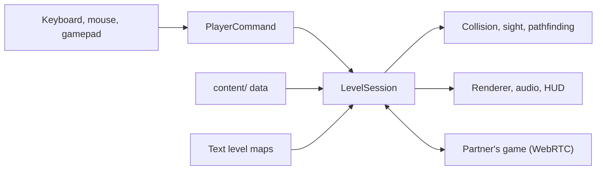
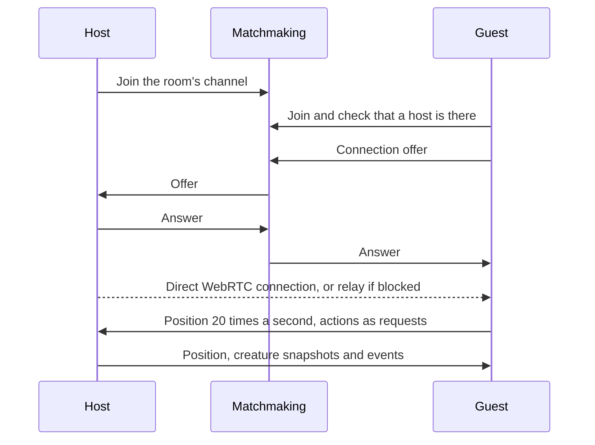

<div align="center">


# REMNANT

A first-person survival horror game that runs in the browser. Play it alone, or online with a friend.

**[Play it here](https://nurmuhammedkanybekov.github.io/remnant/)**

[](https://github.com/nurmuhammedkanybekov/remnant/actions/workflows/deploy.yml)
[](LICENSE)


</div>

## About

In 1991 the Soviet deep-drilling station Object 9 "Zenit" was sealed and
forgotten under the Tian Shan mountains. Eleven days ago a mining crew opened
it again, and the shafts collapsed behind them.

You play as Nur Kanybekov, a structural engineer who wakes up on the deepest
sublevel with a pistol that isn't his and a flashlight that is almost dead.
The radio still works, and a calm voice on it offers to guide you to the
surface, 2.4 km above. The things down there are blind, but they hear
everything.

I built REMNANT from scratch in TypeScript and Three.js as a way to learn the
parts of software I don't touch in backend work: real-time rendering, game AI,
3D audio, networking and performance. There is no game engine underneath, and
almost everything you see and hear (the creatures, the characters, the music,
most of the sound) is generated in code.

<table>
  <tr>
    <td width="50%"></td>
    <td width="50%"></td>
  </tr>
  <tr>
    <td></td>
    <td></td>
  </tr>
  <tr>
    <td></td>
    <td></td>
  </tr>
</table>

## Contents

- [What's in the game](#whats-in-the-game)
- [How to play](#how-to-play)
- [Co-op](#co-op)
- [Saves](#saves)
- [How it works](#how-it-works)
- [Running it yourself](#running-it-yourself)
- [Credits and license](#credits-and-license)

## What's in the game

- A campaign of ten hand-built levels with a story told over the radio,
  notes from the people who were there before you, a three-phase boss and two
  endings.
- Stealth that actually matters. Every step makes noise, sprinting and wading
  make more, and your flashlight lets creatures spot you from twice as far.
- Nine kinds of creature, each designed to break a habit the previous one
  taught you: one that only hears, one that freezes in your light, one that
  waits on the ceiling, one that imitates the voice on the radio.
- Three weapons, silent takedowns from behind, and medkits you carry and use
  when you choose.
- Online co-op for two players with a room code. No accounts or installs.
- An inventory with your gear, a journal of every note you've found, and a
  log of the radio.
- Three character looks, five difficulty modes, cloud saves, full gamepad
  support, rebindable controls and accessibility options.

## How to play

Open the game in a desktop browser, press any key and choose New Game.
Headphones help a lot, because most threats are heard before they are seen.

| Action                | Keyboard and mouse | Gamepad  |
| --------------------- | ------------------ | -------- |
| Move / look           | WASD / mouse       | Sticks   |
| Fire / reload         | Left click / R     | RT / X   |
| Sprint / crouch       | Shift / C          | LT / B   |
| Flashlight            | F                  | LB       |
| Use, hold to revive   | E                  | A        |
| Melee or takedown     | V or right click   | RB       |
| Medkit                | H                  | D-pad up |
| Switch weapon         | 1 2 3, Q or wheel  | Y        |
| Inventory and journal | Tab or I           | View     |
| Pause                 | Esc                | Menu     |

All keyboard and mouse controls can be rebound in the Controls menu.

### Difficulty

- **Story**: for the plot. Few creatures, and they are slow to notice you.
- **Normal**: how I meant it to be played. More creatures, and they hit hard.
- **Nightmare**: more than twice the creatures, sharper senses, scarce ammo.
- **Ironman**: Normal, but with one life for the whole campaign.
- **Aizi**: harder than Nightmare in every way, the fewest supplies, and one
  life. If you die, the run is over.

The exact numbers for each mode are in the
[design document](docs/GAME_DESIGN.md#difficulty-contentdifficultyts).

### Inventory and character


Tab opens the inventory. The Equipment tab shows your health, battery,
medkits, keycard and ammo for each weapon. The Journal keeps every note you
have picked up, across all your runs, and the Radio log has everything said
on the current level.

In Settings you can pick how you look: a light-skinned man, a dark-skinned
man or a woman. It changes your hands in first person, and it is how your
partner sees you in co-op.

## Co-op


One player opens Co-op, chooses Host a Game and gets a five-letter room code.
The other chooses Join a Game and types it in. That's all.

When you play together, both of you are hunted, and there are more creatures
than in solo play. If your health runs out you go down instead of dying, and
your partner has 45 seconds to reach you and hold E to revive you. Keycards,
doors, generators and checkpoints are shared, and you leave each level
together. If one of you leaves, the host keeps playing.

The browsers find each other through a free matchmaking service and then
connect directly. On networks that block direct connections (some schools,
offices and mobile carriers) the game switches to a relay automatically.

<details>
<summary>Troubleshooting and adding your own relay</summary>

| You see                                | Try this                                                               |
| -------------------------------------- | ---------------------------------------------------------------------- |
| "No game with that code"               | Check the code. Codes never use 0, O, 1, I or L.                       |
| "A different version of REMNANT"       | Both players refresh the page. The build number is on every screen.    |
| "That game already has two players"    | The host opens a new room.                                             |
| "Couldn't connect to the other player" | The screen shows the last connection steps. Try again, or add a relay. |

The game already gets a relay from the matchmaking service. If you want your
own, [Metered's Open Relay](https://www.metered.ca/tools/openrelay/) is free
for 20 GB a month, which is hundreds of hours of play:

1. Sign up and create a TURN project. Your app gets a domain such as
   `remnant.metered.live`.
2. Under Manage TURN Credentials, add a credential and copy its API key.
   (The `pk_live_` key and the secret key won't work for this.)
3. In the GitHub repository, go to Settings, Secrets and variables, Actions,
   Variables, and add `METERED_APP` (the domain) and `METERED_API_KEY`.
4. Re-run the Deploy to GitHub Pages workflow. The co-op menu will say
   "Relay: on".

Any other TURN server works too, through `TURN_URLS`, `TURN_USERNAME` and
`TURN_CREDENTIAL`.

</details>

## Saves

The game saves in your browser at the start of every level and at
checkpoints. From the Saves screen on the main menu you can also:

- **Sign in with Google** to keep your progress in the cloud and continue on
  another computer. Changes upload a few seconds after they happen. When two
  copies meet, nothing is lost: unlocks, endings and notes are combined, and
  you continue whichever run you played most recently.
- **Export and import a save file**, which works without any account.

<details>
<summary>Setting up cloud saves on your own copy (free, about 10 minutes)</summary>

Cloud saves use Firebase's free Spark plan, which needs no credit card. A
save is a few kilobytes, so the free limits are far more than enough.

1. In the [Firebase console](https://console.firebase.google.com/), create a
   project and turn Google Analytics off.
2. Authentication, Sign-in method: enable **Google**.
3. Authentication, Settings, Authorized domains: add your GitHub Pages
   domain, for example `nurmuhammedkanybekov.github.io`.
4. Firestore Database: create a database in production mode.
5. Firestore, Rules: paste in [`firebase/firestore.rules`](firebase/firestore.rules)
   and publish. Each player can then read and write only their own save.
6. Project settings, General, Your apps: add a Web app and copy `apiKey` and
   `projectId` from its config. Copy the key exactly; it starts with `AIza`.
7. In the GitHub repository, add the variables `FIREBASE_API_KEY` and
   `FIREBASE_PROJECT_ID`, then re-run the Deploy to GitHub Pages workflow.

The web API key is meant to be public. The database rules are what protect
the data.

</details>

## How it works

The game is a static website with no server of its own. `Game` owns the
renderer, audio, menus and saves, and runs the main loop. Each attempt at a
level is a fresh `LevelSession`, so nothing can leak from one attempt into the
next. Player input is turned into a `PlayerCommand` before it reaches the
simulation, which is why the same code can be driven by a keyboard, a
gamepad, a test script or the network.



### Co-op networking



The host runs the world: creatures, doors, generators, the boss and the end
of each level. Each player moves their own character locally, so movement
never waits for the network. The guest's creatures follow the host's
snapshots. Events go over a reliable channel and positions over a fast one,
where a late packet is simply dropped.

Getting this to work on real home networks took more effort than the rest of
co-op put together. The handshake is re-sent until it is answered,
keep-alive timers run in a Web Worker so background tabs don't stall them,
every level attempt is numbered so old messages can't leak into a retry, and
two different builds refuse to connect instead of drifting apart.

### A few details I'm happy with

- Changing the number of lights in Three.js recompiles shaders and causes a
  stutter, so the level uses a fixed pool of lights that is reassigned to the
  lamps nearest the player every frame.
- One text grid drives the level geometry, collision, line of sight, bullet
  raycasts and pathfinding.
- Every level is checked by a validator that fails the build if an exit,
  keycard or generator can't be reached.
- Extra creatures on harder difficulties are placed by a seeded algorithm, so
  both co-op players get exactly the same ones.
- Saves are versioned and validated field by field. Old saves are migrated,
  broken values are repaired, and the game still runs if storage is blocked.

### Project layout

```
src/
  game/      app shell, level session, co-op partner, saves
  net/       matchmaking, WebRTC link, relay, cloud saves, protocol
  content/   creatures, weapons, items, difficulty, characters
  world/     level format, parser, validator, builder, grid, pathfinding
  enemies/   AI, creature bodies, boss, projectiles
  player/    input commands, movement, flashlight, health
  weapons/   weapon logic, first-person models
  core/      renderer, input, gamepad, settings
  fx/        textures, particles
  audio/     sound engine, samples, adaptive music
  ui/        HUD, menus, inventory
```

Levels are plain text maps with a small script attached:

```ts
map: [
  "############",
  "#S.a.D..L.A#", // S start, a trigger, D door, L lamp, A ammo
  "#.####.###.#",
  "#.Y..E.K.=X#", // Y intercom, E creature, K keycard, = locked door, X exit
  "############",
],
triggers: {
  a: [radio(op("Something is moving past that door. Stay low.")), checkpoint()],
},
```

Every system and its tuning values are written up in
[docs/GAME_DESIGN.md](docs/GAME_DESIGN.md), the plan and its history in
[docs/ROADMAP.md](docs/ROADMAP.md), and the story in
[docs/STORY.md](docs/STORY.md).

## Running it yourself

You need Node.js 18 or newer.

```bash
git clone https://github.com/nurmuhammedkanybekov/remnant.git
cd remnant
npm install
npm run dev
```

The game is then at http://localhost:5173. Other useful commands:

- `npm run check` runs the type checker, the formatting check and the tests.
  CI runs the same thing, and a failure blocks deployment.
- `npm run build` builds the static site into `dist/`.
- `npm run playtest` lets a bot play the campaign and report on each level.
- `node tools/coop/run.mjs` opens two browsers and plays through a co-op
  session: joining with a code, shared doors and pickups, reviving, retrying,
  finishing a level together and leaving.

There are 179 unit tests covering level validation, collision, pathfinding,
movement, weapons, creature AI, co-op, save merging and cloud sync, settings
and more. Adding `?debug` to the URL exposes test hooks on `window.game`.

Every push to `main` is checked and deployed to GitHub Pages. The optional
repository variables are the relay and cloud save settings described above.

## Credits and license

Recorded sound effects come from [Freesound](https://freesound.org) and
surface textures from [ambientCG](https://ambientcg.com), all released into
the public domain (CC0). The full lists are in
[public/sfx/CREDITS.md](public/sfx/CREDITS.md) and
[public/textures/CREDITS.md](public/textures/CREDITS.md). Thanks to everyone
who shares their work for free.

The code is released under the [MIT License](LICENSE).

Made by **Nurmuhammed Kanybekov**, a Computer Science student at ELTE (Eötvös
Loránd University) in Budapest.
