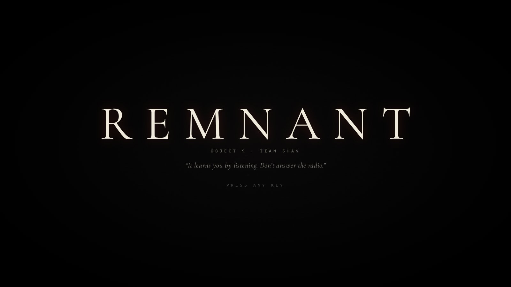
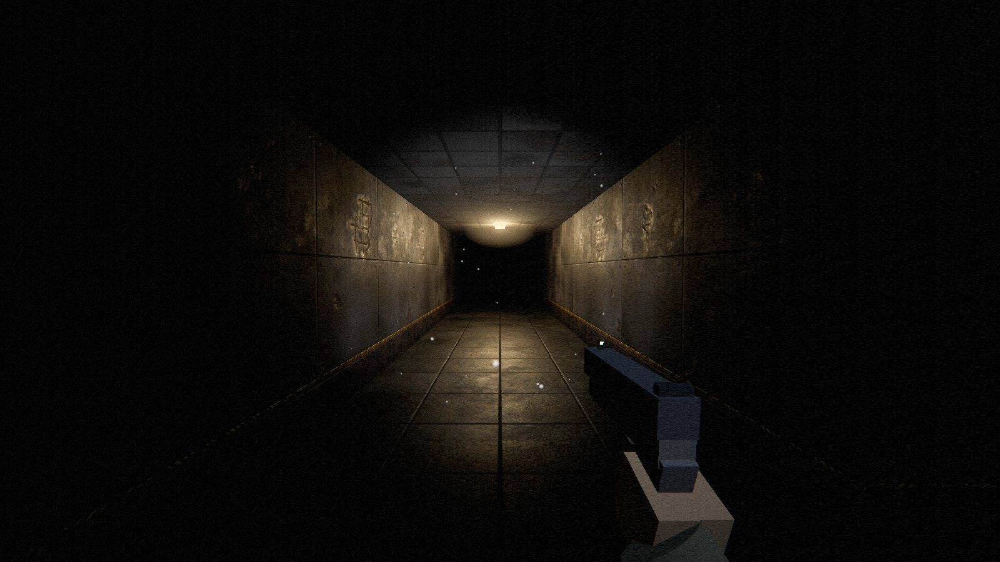
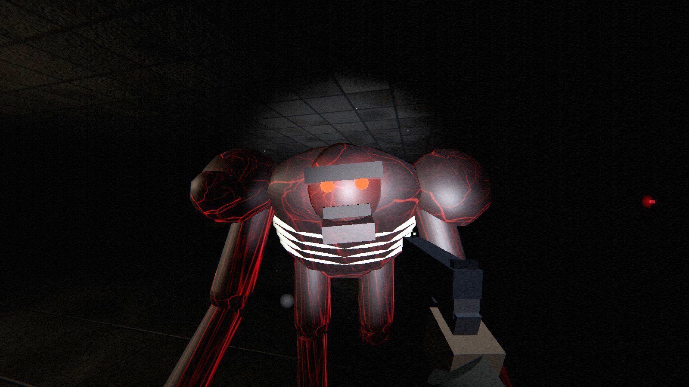
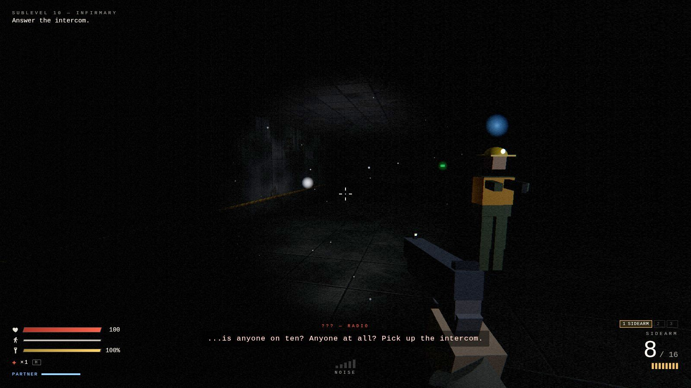
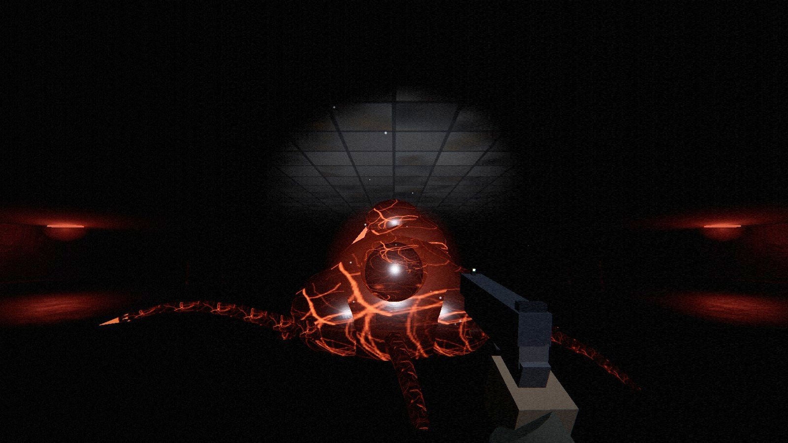
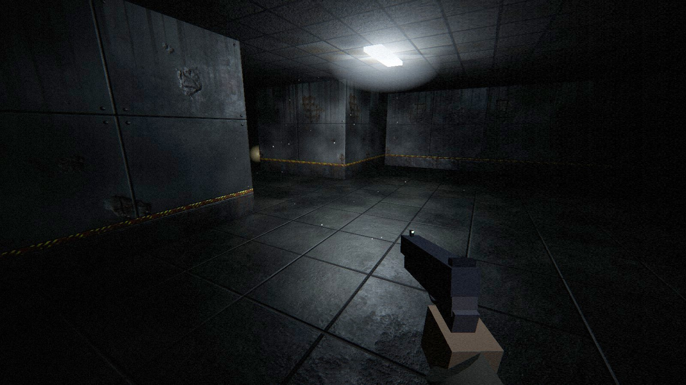
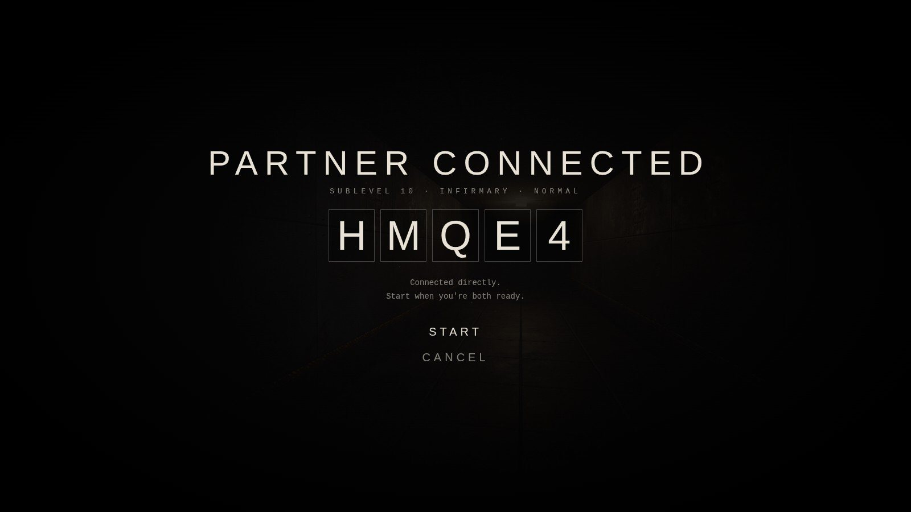
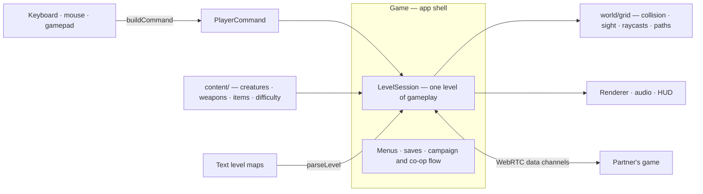
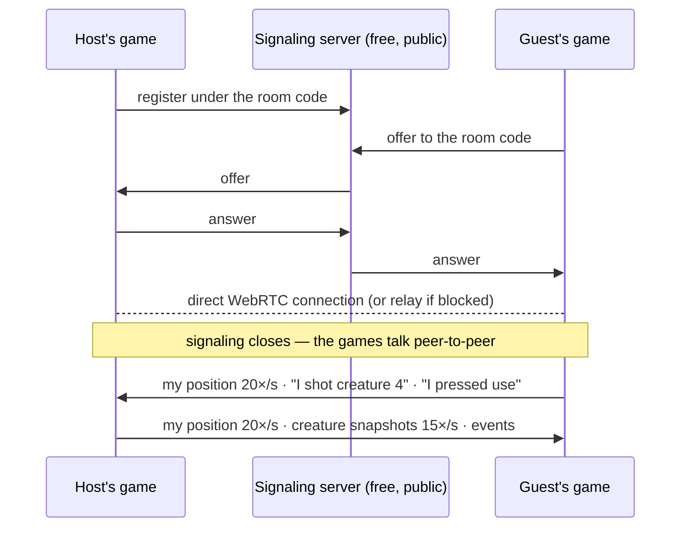

<div align="center">



# REMNANT

**A first-person survival horror game that runs in your browser — alone or with a friend.**

Climb 2.4 km out of a buried Soviet research station, past things that hunt by sound.

[](https://nurmuhammedkanybekov.github.io/remnant/)

[](https://github.com/nurmuhammedkanybekov/remnant/actions/workflows/deploy.yml)
[](LICENSE)


_Desktop browser with keyboard and mouse, or a gamepad. Headphones strongly recommended._

</div>

<table>
  <tr>
    <td width="50%"></td>
    <td width="50%"></td>
  </tr>
  <tr>
    <td></td>
    <td></td>
  </tr>
  <tr>
    <td></td>
    <td></td>
  </tr>
</table>

> **Object 9 "Zenit"**, a Soviet deep-drilling station buried in the Tian Shan
> mountains, was sealed in 1991. Eleven days ago a mining crew reopened it,
> and the shafts collapsed behind them.
>
> You are **Nur Kanybekov**, a structural engineer. You wake up on the deepest
> sublevel with a pistol that isn't yours and a flashlight with a dying
> battery. The only thing that still works is the radio, and there is a calm
> voice on it telling you the way up.
>
> The things in the dark can't see. They don't need to.

## Contents

- [Highlights](#highlights)
- [How to play](#how-to-play)
- [Playing together (co-op)](#playing-together-co-op)
- [Features](#features)
- [How it's built](#how-its-built)
- [Running it locally](#running-it-locally)
- [Testing](#testing)
- [Assets and credits](#assets-and-credits)
- [Roadmap](#roadmap)
- [License](#license) · [Author](#author)

## Highlights

|                              |                                                                                                                              |
| ---------------------------- | ---------------------------------------------------------------------------------------------------------------------------- |
| 🎮 **Full campaign**         | Ten hand-built levels, a story told over the radio, two endings, a three-phase boss.                                         |
| 👥 **Online co-op**          | Two players, one room code. No accounts, no install, no server to pay for.                                                   |
| 👂 **Stealth that matters**  | Every step makes noise; your flashlight gives you away. Nine creatures, each built to break a habit the last one taught you. |
| 🔊 **Sound you can hunt by** | Recorded weapons and creatures, 3D positioning, walls that muffle, and music that tightens as they close in.                 |
| 🧱 **Built from scratch**    | TypeScript and Three.js, one runtime dependency. Creatures, music and most sound are generated in code.                      |
| ✅ **Tested**                | 150+ unit tests, every level machine-checked to be completable, a bot that plays the campaign, and a two-browser co-op test. |

## How to play

**[Open the game](https://nurmuhammedkanybekov.github.io/remnant/)**, press any key, and choose **New Game**.

Your goal is to climb from Sublevel 10 to the surface: find keycards, restore
power, and listen to the radio — but don't believe everything it says.
Killing creatures is optional, and often a bad idea.

| Action           | Keyboard & mouse   | Gamepad     |
| ---------------- | ------------------ | ----------- |
| Move             | W A S D / arrows   | Left stick  |
| Look             | Mouse              | Right stick |
| Fire             | Left click         | RT          |
| Reload           | R                  | X           |
| Sprint (loud)    | Shift              | LT          |
| Crouch (quiet)   | C / Ctrl           | B           |
| Flashlight       | F                  | LB          |
| Use / revive     | E (hold to revive) | A           |
| Melee / takedown | V / Right click    | RB          |
| Medkit           | H                  | D-pad ↑     |
| Switch weapon    | 1 2 3 / Q / wheel  | Y           |
| Pause            | Esc                | Menu        |

Every keyboard and mouse action can be rebound under **Controls**.

**Difficulty.** _Story_ is for the plot. _Normal_ is the intended experience:
extra creatures on every level, and they hit hard and run fast once they've
found you. _Nightmare_ doubles the creatures and halves the forgiveness.
_Ironman_ is Normal with one life for the whole campaign.

## Playing together (co-op)



1. **The host** opens **Co-op → Host a Game**, picks a sublevel and a
   difficulty, and gets a five-character **room code**.
2. **The partner** opens **Co-op → Join a Game** and types the code.
3. The host presses **Start**.

In co-op:

- **The creatures hunt you both.** There are more of them, and they're
  tougher. Each goes after whoever is closest, hears both of you, and either
  flashlight freezes a Watcher.
- **Nobody dies alone.** At zero health you go **down**. Your partner has 45
  seconds to reach you and **hold E** to get you back up. If you're both down,
  the level restarts for both from the last checkpoint.
- **Progress is shared.** One keycard opens the doors for both of you;
  generators, intercoms, story events and checkpoints happen for both; and you
  leave each level together.
- **Your partner is really there** — a figure in a hard hat whose headlamp
  lights the corridor for you, with their gunshots and footsteps coming from
  where they are and their health on your HUD.
- If your partner leaves, the host carries on alone.

### If you can't connect

The two browsers connect **directly** to each other, which works on almost all
home networks. Some strict networks (school, office, some mobile data) block
direct connections between browsers. For those, the game falls back to a
free **relay** once it has been set up for the site (below). The relay is
only used when a direct connection is impossible, and the lobby tells you
which one you got.

<details>
<summary><b>Setting up the free relay (3 minutes, no credit card)</b></summary>

The relay is [Metered's Open Relay](https://www.metered.ca/tools/openrelay/),
free for 20 GB a month. A two-player game uses roughly 30–40 MB an hour, so
that's hundreds of hours of play.

1. Sign up at [metered.ca/tools/openrelay](https://www.metered.ca/tools/openrelay/)
   (free, no credit card) and create an app. Note its domain — something like
   `remnant.metered.live` — and copy the **API key** from the dashboard.
2. In this repository on GitHub: **Settings → Secrets and variables →
   Actions → Variables → New repository variable**. Add:
   - `METERED_APP` = your app domain, e.g. `remnant.metered.live`
   - `METERED_API_KEY` = the API key
     (Saving them as **Secrets** instead works too.)
3. Re-run the deploy: **Actions → Deploy to GitHub Pages → Run workflow**.
4. Open **Co-op** in the game: it says **Relay: on** when it worked.

Any other TURN server works too: set `TURN_URLS` (comma-separated),
`TURN_USERNAME` and `TURN_CREDENTIAL` instead.

</details>

Other messages you might see:

| Message                                 | What to do                                                                         |
| --------------------------------------- | ---------------------------------------------------------------------------------- |
| _No game with that code_                | Check the code with the host. Codes never contain 0, O, 1, I or L.                 |
| _A different version of REMNANT_        | Both of you refresh the page (one of you has an older copy cached).                |
| _That game already has two players_     | Ask the host to open a new room.                                                   |
| _Couldn't reach the matchmaking server_ | Check your connection. The free public server may also be briefly down; try again. |

## Features

### Stealth and survival

- **Everything makes noise.** Walking, sprinting, crouching and wading each
  carry a different distance, and a HUD meter shows how loud you are.
  Gunshots carry through walls.
- **The flashlight is a trade-off.** You see more, but creatures spot you from
  more than twice as far away. The battery drains; only pickups recharge it
  properly.
- **Scarcity.** No health regeneration, limited ammo and stamina, and your
  loadout carries over between levels.

### Creatures

| Creature        | What it does                                                                 |
| --------------- | ---------------------------------------------------------------------------- |
| **Husk**        | Fast, fragile hunter.                                                        |
| **Brute**       | Slow, tough, hits hard. Can't be taken down quietly.                         |
| **Listener**    | Blind. The flashlight means nothing to it; every footstep does.              |
| **Watcher**     | Freezes while a flashlight is on it, and is terrifyingly fast when it isn't. |
| **Crawler**     | Clings upside down to the ceiling and drops on you.                          |
| **Spitter**     | Keeps its distance and lobs acid you can sidestep.                           |
| **Swarm**       | A pack of rewritten rats: fast, weak, everywhere.                            |
| **Mimic**       | Hides and imitates footsteps, pickups — and the Operator's voice.            |
| **The Remnant** | A three-phase boss: armoured hide, a core that only opens when it attacks.   |

They patrol, investigate what they hear, chase you, lose you and search for
you. Suspicion builds while you're in view, attacks have a wind-up you can
dodge, and a quiet melee strike from behind kills outright.

### Combat

- **Three weapons:** a sidearm, a nearly silent **rivet gun**, and a pump
  **shotgun** that loads shell by shell.
- **Takedowns and shoves:** melee from behind an unaware creature is a silent
  kill; from the front it buys you a second.
- **Medkits are carried** (up to three) and used when you choose — which
  takes time you might not have.

### Campaign

- **Ten levels**, from the infirmary on Sublevel 10 to the surface, each
  introducing something new: flooded halls, keycard doors, a maze of ducts,
  generators that draw every creature on the floor, the hive.
- **A story told through the radio**, with subtitles and a synthesized radio
  voice. Notes left by survivors fill in the rest. **Two endings.**
- **Checkpoints**, saves, chapter select and best times per level.

### Look and sound

- **Photo-scanned materials** (concrete, steel, hazard paint, wood, ceiling
  tiles) with normal and roughness maps, and the facility's own details
  painted over them in code: panel seams, rivets, kick-plates, water damage,
  blood.
- **Lighting:** a real flashlight, flickering and dying ceiling lamps,
  emergency lights, ACES tone mapping, and a post-processing pass with film
  grain, vignette and damage effects.
- **Audio:** recorded weapons, footsteps, doors and creature voices, placed in
  3D with distance falloff, wall muffling and reverb; an ambient drone, a
  heartbeat at low health, and **adaptive music** — horror sound design
  rather than a tune — that swells and fades with the danger you're in.

### Options

Four difficulties, fully rebindable controls, gamepad support for play and
every menu, Low/Medium/High graphics, and accessibility settings: subtitle
size, HUD size, a colour-blind friendly HUD, reduced camera shake, field of
view, sensitivity, invert-Y, and separate music and master volume.

## How it's built



- **`Game`** owns the long-lived services (renderer, audio, UI, saves), runs
  the main loop and moves between menus, levels and co-op lobbies.
- **`LevelSession`** is one attempt at one level. It's created fresh every
  time and thrown away afterwards, so no state leaks between levels or retries.
- **`PlayerCommand`** is the only way player intent reaches the simulation —
  from the keyboard, a gamepad, or the headless test harness.
- **`content/`** is data. Adding a creature means adding a definition; its
  map glyph works in levels immediately.

### Co-op networking



The **host runs the world**: creatures, doors, generators, the boss and the
end of the level. Each player moves their **own** character locally, so
movement never waits on the network. The guest's creatures are puppets that
follow the host's snapshots, and the guest's actions go to the host as
requests. Events travel on a reliable channel and the position streams on a
fast, lossy one, where a late packet is worthless anyway. Every level attempt
is numbered, so messages from before a retry can't leak into the next one; a
background tab keeps the world running; and different versions refuse to
connect rather than drift apart.

### Engineering notes

- **A fixed light budget.** Changing the number of lights forces shader
  recompiles (visible stutter), so a pool of lamp lights is reassigned each
  frame to the lamps nearest the player, and lights that come and go (muzzle
  flash, your partner's headlamp) exist from the start at zero intensity.
- **One grid, many uses.** The same text map drives geometry, circle-vs-grid
  collision, line of sight, a DDA raycast for bullets, and BFS pathfinding.
- **Levels are verified, not trusted.** A lock-aware validator flood-fills
  every map and fails the build if an exit, keycard, generator or pickup is
  unreachable, or a keycard sits behind the door it opens.
- **Deterministic extra creatures.** The harder difficulties and co-op add
  creatures by a seeded placement (far from the start, spread out, only kinds
  the story has already introduced), so both co-op players get the same ones.
- **Saves that can't brick the game.** The save is versioned and validated
  field by field: old versions are migrated, corrupt values are repaired, and
  the game runs even when browser storage is blocked.
- **Logic that runs without a GPU.** Parsing is separate from geometry, and
  the simulation runs on commands, so almost everything is testable in Node.

```
src/
├── game/       app shell, level session, co-op partner, saves, loadout, stats
├── net/        co-op: signaling, WebRTC link, relay settings, message protocol
├── content/    creature, weapon, item, difficulty and sound definitions
├── world/      level format, parser, validator, builder, grid, pathfinding, extra creatures
├── enemies/    AI state machine, creature bodies, boss, projectiles
├── player/     commands, movement, flashlight, health
├── weapons/    weapon logic, first-person viewmodel
├── core/       renderer, input, gamepad, actions & bindings, settings, quality
├── fx/         textures, particles
├── audio/      sound engine, recorded samples, adaptive music
└── ui/         HUD, menus, styles
```

A level is a text map plus a little script:

```ts
map: [
  "############",
  "#S.a.D..L.A#", // S start, a trigger, D door, L lamp, A ammo
  "#.####.###.#",
  "#.Y..E.K.=X#", // Y intercom, E husk, K keycard, = security door, X exit
  "############",
],
triggers: {
  a: [radio(op("Something is moving past that door. Stay low.")), checkpoint()],
},
```

Every system and its tuning values are documented in
[`docs/GAME_DESIGN.md`](docs/GAME_DESIGN.md).

## Running it locally

Requires Node.js 18 or newer.

```bash
git clone https://github.com/nurmuhammedkanybekov/remnant.git
cd remnant
npm install
npm run dev        # http://localhost:5173
```

| Script             | What it does                                       |
| ------------------ | -------------------------------------------------- |
| `npm run dev`      | Dev server with hot reload                         |
| `npm run build`    | Typecheck and build a static site into `dist/`     |
| `npm run preview`  | Serve the production build                         |
| `npm test`         | Unit tests                                         |
| `npm run check`    | Typecheck + formatting + tests (what CI runs)      |
| `npm run format`   | Format everything with Prettier                    |
| `npm run playtest` | A bot plays the campaign and reports on each level |

Every push to `main` is checked and deployed to GitHub Pages automatically.
Add `?debug` to the URL for test hooks on `window.game`, and
`?signal=wss://…/peerjs` to use your own
[PeerJS server](https://github.com/peers/peerjs-server) for co-op matchmaking.

## Testing

- **Unit tests** (Vitest, 150+): level parsing and validation, collision,
  raycasts, pathfinding, movement, weapons, creature AI run headlessly with
  stand-in bodies (blindness, light-freezing, ceiling drops, spitting, lures,
  takedowns, the boss's phases), co-op targeting and snapshots, extra
  creature placement, room codes, relay settings, loadouts, bindings,
  settings and save migration. **Every shipped level is checked to be
  completable.**
- **Playtest bot** (`npm run playtest`): plays the whole campaign in a real
  browser and reports time, deaths, damage, kills and ammo per level.
- **Co-op end-to-end** (`tools/coop/run.mjs`): two real browsers go through
  the menus with a room code and check a dozen scenarios — shared doors and
  pickups, the guest's shots killing the host's creature, down and revive,
  wipe and retry, leaving together, a partner leaving — both directly and
  forced through a relay.
- **CI** runs the typecheck, formatting check and tests on every push, and a
  failing check blocks deployment.

## Assets and credits

Creatures, your partner, levels, music and most sound effects are generated
in code. Two kinds of real-world material are used where code can't match
them — both public domain (CC0), and each with a generated fallback:

- **Sound effects** (weapons, footsteps, doors, creature voices) from
  [Freesound](https://freesound.org) contributors — see
  [`public/sfx/CREDITS.md`](public/sfx/CREDITS.md).
- **Surface materials** (concrete, steel, wood, ceiling tiles) from
  [ambientCG](https://ambientcg.com) — see
  [`public/textures/CREDITS.md`](public/textures/CREDITS.md).

Thank you to everyone who shares their work for free.

## Roadmap

| Phase                                           | Status  |
| ----------------------------------------------- | ------- |
| 1. Foundations                                  | ✅ Done |
| 2. Campaign: 10 levels, radio dialogue, endings | ✅ Done |
| 3. Creatures, melee, more weapons               | ✅ Done |
| 4. Adaptive music, interface, gamepad           | ✅ Done |
| 5. Accounts and cloud saves                     | Planned |
| 6. Two-player online co-op                      | ✅ Done |

Details in [`docs/ROADMAP.md`](docs/ROADMAP.md); the story bible is
[`docs/STORY.md`](docs/STORY.md).

## License

[MIT](LICENSE). The CC0 sounds and textures are in the public domain.

## Author

**Nurmuhammed Kanybekov** — Computer Science student at ELTE (Eötvös Loránd
University), Budapest. I wanted a project that pushed me past backend work:
real-time rendering, game AI, audio, networking and performance, all in one
codebase, built from scratch.
